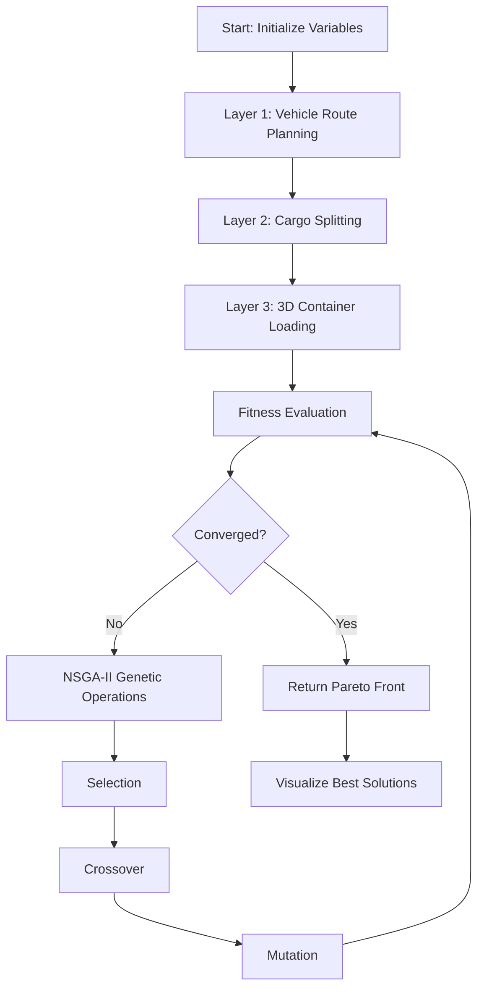
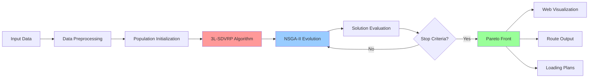
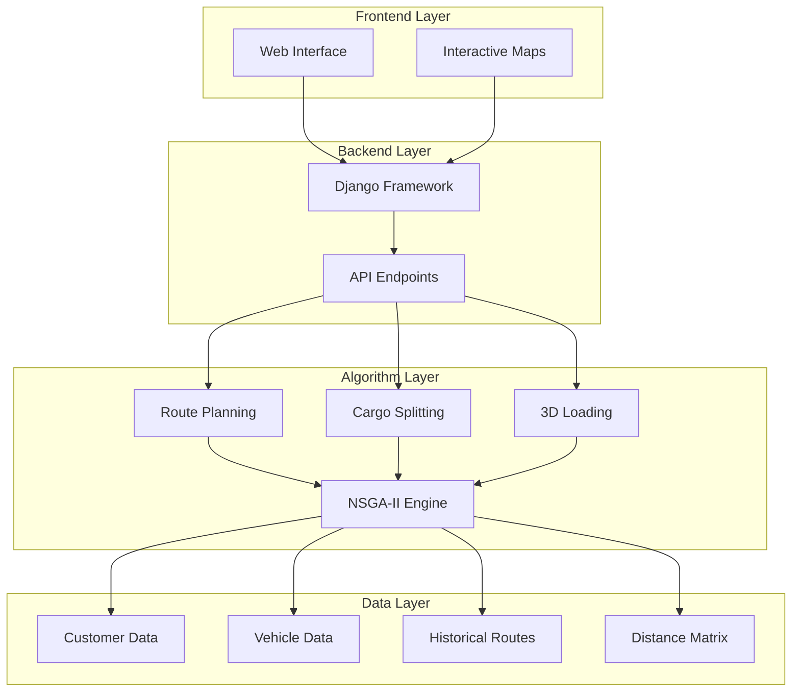
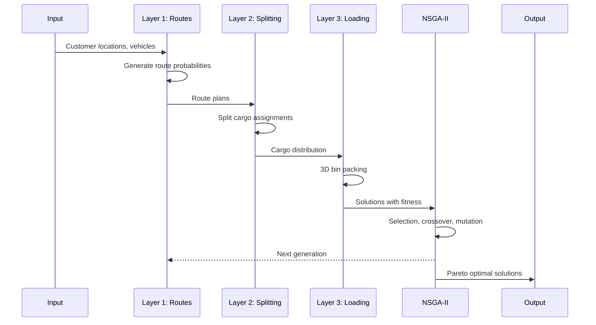

# 🚚 3L-SDVRP: Three-Layer Split Delivery Vehicle Routing Problem with 3D Container Loading

<div align="center">

[](https://www.python.org/downloads/)
[](LICENSE)
[](https://jupyter.org/)
[](https://www.djangoproject.com/)
[]()

**A Data-Driven Multi-Objective Optimization Algorithm for Vehicle Routing with 3D Container Loading Constraints**

[Features](#-key-features) •
[Installation](#-installation) •
[Usage](#-usage) •
[Architecture](#-system-architecture) •
[Documentation](#-documentation) •
[Contributing](#-contributing)

</div>

---

## 📋 Table of Contents

- [Overview](#-overview)
- [Key Features](#-key-features)
- [Problem Statement](#-problem-statement)
- [Solution Approach](#-solution-approach)
- [System Architecture](#-system-architecture)
- [Installation](#-installation)
- [Usage](#-usage)
- [Project Structure](#-project-structure)
- [Technologies](#-technologies-used)
- [Algorithm Details](#-algorithm-details)
- [Web Interface](#-web-interface)
- [Contributing](#-contributing)
- [License](#-license)
- [Authors](#-authors)
- [Acknowledgments](#-acknowledgments)

---

## 🌟 Overview

**3L-SDVRP** is an advanced optimization system that solves the complex problem of vehicle routing combined with three-dimensional container loading. This project implements a novel **three-layer data-driven algorithm** using **NSGA-II (Non-dominated Sorting Genetic Algorithm II)** to optimize both routing decisions and cargo packing simultaneously.

### What Makes This Special?

- 🎯 **Multi-Objective Optimization**: Minimizes both travel distance and maximizes container space utilization
- 📦 **3D Bin Packing**: Intelligent three-dimensional cargo loading with weight and volume constraints
- 🚛 **Split Delivery**: Allows splitting customer orders across multiple vehicles when beneficial
- 📊 **Data-Driven**: Uses historical routing data to generate better initial populations
- 🗺️ **Real-World Integration**: Includes web-based visualization with interactive maps
- ⚡ **Evolutionary Algorithm**: Employs NSGA-II for finding Pareto-optimal solutions

---

## 🎯 Key Features

### Core Optimization Features

- **Vehicle Route Planning Module**: Generates optimized delivery routes using Dirichlet distribution and historical data
- **Cargo Splitting Module**: Intelligently splits cargo across vehicles based on capacity constraints
- **3D Loading Optimization**: Maximizes container space utilization with 3D bin packing algorithm
- **Multi-Objective Fitness**: Dual fitness functions for distance minimization and load optimization

### Technical Features

- **NSGA-II Implementation**: Fast non-dominated sorting with crowding distance
- **Data-Driven Population Initialization**: Uses historical routing patterns for better convergence
- **Real-Time Map Integration**: Integration with Neshan Maps API (Iranian mapping service)
- **Web-Based Visualization**: Django-powered web interface for route visualization
- **Scalable Architecture**: Handles multiple vehicles, customers, and cargo types

---

## 🎯 Problem Statement

The **Split Delivery Vehicle Routing Problem with 3D Container Loading (3L-SDVRP)** combines two challenging optimization problems:

### 1. Vehicle Routing Problem (VRP)
- Determine optimal routes for a fleet of vehicles to deliver goods to multiple customers
- Minimize total travel distance while respecting vehicle capacity constraints
- Allow split deliveries when a single vehicle cannot fulfill entire customer demand

### 2. 3D Container Loading Problem (3D-CLP)
- Arrange three-dimensional cargo items within vehicle containers
- Maximize space utilization while respecting weight limits
- Ensure practical loading constraints (stability, accessibility, fragility)

### Why This Matters

Real-world logistics operations face these challenges simultaneously:
- 📦 **E-commerce fulfillment**: Thousands of packages with varying dimensions
- 🏪 **Retail distribution**: Mixed cargo types to multiple store locations
- 🏭 **Manufacturing logistics**: Components and finished goods with complex geometries
- ♻️ **Reverse logistics**: Collection and consolidation of returns

---

## 💡 Solution Approach

Our **Three-Layer Algorithm** tackles this complex problem through a hierarchical approach:



### Layer 1: Route Planning Module
- Uses **Dirichlet distribution** to generate route probabilities
- Incorporates **historical routing data** for data-driven initialization
- Creates diverse initial population for genetic algorithm

### Layer 2: Cargo Splitting Module
- Determines optimal distribution of cargo across vehicles
- Uses **multinomial distribution** for probabilistic splitting
- Respects vehicle capacity constraints (volume and weight)

### Layer 3: 3D Loading Module
- Implements **3D bin packing algorithm** (py3dbp library)
- Optimizes cargo placement within container dimensions
- Considers weight distribution and loading feasibility

### NSGA-II Optimization
- **Fast Non-dominated Sorting**: Ranks solutions by Pareto dominance
- **Crowding Distance**: Maintains solution diversity
- **Genetic Operators**: Crossover and mutation for exploration
- **Elitism**: Preserves best solutions across generations

---

## 🏗️ System Architecture



### Component Architecture



---

## 🚀 Installation

### Prerequisites

- **Python 3.8+** (tested on Python 3.8.2)
- **pip** (Python package manager)
- **Jupyter Notebook** (for running the main algorithm)
- **Git** (for cloning the repository)

### Step-by-Step Installation

1. **Clone the Repository**
   ```bash
   git clone https://github.com/safarzadeh-reza/3L-SDVR.git
   cd 3L-SDVR
   ```

2. **Create Virtual Environment (Recommended)**
   ```bash
   # Windows
   python -m venv venv
   venv\Scripts\activate

   # Linux/Mac
   python3 -m venv venv
   source venv/bin/activate
   ```

3. **Install Required Packages**
   ```bash
   pip install -r requirements.txt
   ```

4. **Verify Installation**
   ```bash
   python -c "import numpy, scipy, matplotlib, py3dbp, networkx, sklearn; print('All packages installed successfully!')"
   ```

### Dependencies

The project requires the following main packages:

| Package | Version | Purpose |
|---------|---------|---------|
| numpy | 1.19.0 | Numerical computations |
| scipy | 1.5.1 | Statistical distributions |
| matplotlib | 3.2.2 | Visualization |
| pandas | 1.0.5 | Data manipulation |
| py3dbp | 1.1.2 | 3D bin packing |
| scikit-learn | 0.23.1 | Machine learning utilities |
| networkx | 2.4 | Graph operations |
| ipython | 7.16.1 | Interactive computing |
| django | 3.0+ | Web framework (for web_gis) |

---

## 📖 Usage

### Quick Start with Jupyter Notebook

1. **Launch Jupyter Notebook**
   ```bash
   jupyter notebook
   ```

2. **Open the Main Notebook**
   - Navigate to and open `3L-SDVR.ipynb`

3. **Run the Algorithm**
   
   **Step 1: Initialize Variables**
   ```python
   # Initialize problem parameters
   (n_customer, N, V, Cat, IT, IT_num, nv, Container_vehicle, 
    locationtuples, RP, A, nmaps, dist, historical_routes, 
    historical_routes_tuples) = initVariables()
   ```

   **Step 2: Create Initial Population**
   ```python
   # Generate data-driven initial population
   pop_size = 20  # Population size
   max_gen = 50   # Maximum generations
   
   pop = InitializePopulation(pop_size, max_gen, n_customer, N, V, Cat, IT, 
                               IT_num, nv, Container_vehicle, locationtuples, 
                               RP, A, nmaps, dist, historical_routes, 
                               historical_routes_tuples)
   ```

   **Step 3: Run NSGA-II Optimization**
   ```python
   # Execute the main optimization algorithm
   final_pop = NSGA_II_main(pop, max_gen, n_customer, N, V, Cat, IT, 
                             IT_num, nv, Container_vehicle, locationtuples, 
                             RP, A, nmaps, dist, historical_routes, 
                             historical_routes_tuples)
   ```

4. **Analyze Results**
   ```python
   # Extract best solution from Pareto front
   best_solution = final_pop[0]
   
   # View routing plan
   print("Optimal Routes:", best_solution['route'])
   
   # View loading plan
   print("Container Loading:", best_solution['pack_bins'])
   
   # View fitness values
   print("Total Distance:", best_solution['fitness_1'])
   print("Loading Efficiency:", best_solution['fitness_2'])
   ```

### Customizing the Problem

#### Modify Number of Customers
```python
# In initVariables() function
n_customer = 5  # Change from 3 to 5 customers
```

#### Adjust Vehicle Fleet
```python
# In initVariables() function
nv = 5  # Change number of vehicles
# Vehicle capacities will be randomly generated
```

#### Change Cargo Parameters
```python
# In initVariables() function
Cat = 15  # Number of cargo items per customer
```

#### Adjust Algorithm Parameters
```python
pop_size = 30   # Larger population for better exploration
max_gen = 100   # More generations for better convergence
```

---

## 📁 Project Structure

```
3L-SDVR/
├── 📓 3L-SDVR.ipynb              # Main algorithm implementation (Jupyter Notebook)
├── 📄 README.md                  # This file
├── 📄 requirements.txt           # Python dependencies
├── 📁 References/                # Research papers and documentation
├── 📁 web_gis/                   # Django web application
│   ├── 📁 web_analysis/          # Django project settings
│   │   ├── settings.py          # Configuration
│   │   ├── urls.py              # URL routing
│   │   └── wsgi.py              # WSGI configuration
│   ├── 📁 maps/                  # Maps application
│   │   ├── views.py             # View controllers
│   │   ├── models.py            # Data models
│   │   └── urls.py              # App URLs
│   ├── 📁 api/                   # REST API
│   │   ├── views.py             # API endpoints
│   │   └── urls.py              # API routes
│   ├── 📁 templates/             # HTML templates
│   ├── 📁 static/                # Static files (CSS, JS, images)
│   └── manage.py                # Django management script
└── 📁 docs/                      # Additional documentation (if added)
```

### Key Files

- **3L-SDVR.ipynb**: Complete implementation of the three-layer algorithm, NSGA-II, and all optimization modules
- **requirements.txt**: All Python package dependencies with versions
- **web_gis/**: Web-based visualization system for routing results
- **References/**: Academic papers and related research (not included in repository per request)

---

## 🛠️ Technologies Used

### Core Algorithm Stack

- **Python 3.8+**: Primary programming language
- **NumPy**: Array operations and numerical computations
- **SciPy**: Statistical distributions (Dirichlet, Multinomial)
- **Matplotlib**: Data visualization and plotting
- **NetworkX**: Graph-based route representation

### Optimization & Machine Learning

- **py3dbp**: 3D bin packing library for container loading
- **scikit-learn**: Utility functions for ML operations
- **NSGA-II**: Custom implementation of multi-objective genetic algorithm

### Web & Visualization

- **Django 3.0+**: Web framework for visualization interface
- **Neshan Maps API**: Iranian map services for distance calculations
- **HTML/CSS/JavaScript**: Frontend technologies

### Development Tools

- **Jupyter Notebook**: Interactive development environment
- **IPython**: Enhanced interactive Python shell
- **Git**: Version control

---

## 🧮 Algorithm Details

### Algorithm Flow



### Fitness Functions

#### Fitness Function 1: Total Travel Distance
```
F1 = Σ Σ distance(i, j) for all routes
```
- **Objective**: Minimize total distance traveled by all vehicles
- **Calculation**: Sum of distances for all edges in all vehicle routes

#### Fitness Function 2: Loading Efficiency
```
F2 = 1 - (Σ loaded_volume / Σ container_capacity)
```
- **Objective**: Maximize container space utilization
- **Calculation**: Based on fitted vs. total items volume and weight

### NSGA-II Operations

1. **Fast Non-dominated Sorting**
   - Ranks solutions into Pareto fronts
   - Front 1 contains non-dominated solutions
   - Each subsequent front is dominated only by previous fronts

2. **Crowding Distance**
   - Measures solution density in objective space
   - Promotes diversity in the population
   - Prevents premature convergence

3. **Selection**
   - Tournament selection based on rank and crowding distance
   - Elitist approach preserves best solutions

4. **Crossover**
   - Single-point crossover for route chromosomes
   - Preserves valid route segments

5. **Mutation**
   - Random route edge replacement
   - Maintains chromosome feasibility

---

## 🌐 Web Interface

The project includes a Django-based web application for visualizing routing solutions on interactive maps.

### Running the Web Server

1. **Navigate to Web Directory**
   ```bash
   cd web_gis
   ```

2. **Apply Database Migrations**
   ```bash
   python manage.py migrate
   ```

3. **Run Development Server**
   ```bash
   python manage.py runserver
   ```

4. **Access the Interface**
   - Open browser to: `http://localhost:8000`
   - View interactive route maps
   - Explore vehicle assignments

### Features

- 📍 **Interactive Maps**: Visualize routes on real maps
- 🚛 **Vehicle Tracking**: See individual vehicle routes
- 📊 **Statistics Dashboard**: View optimization metrics
- 🗺️ **Route Comparison**: Compare different solutions

---

## 🤝 Contributing

We welcome contributions to improve the 3L-SDVR project! Here's how you can help:

### Ways to Contribute

- 🐛 **Report Bugs**: Open an issue describing the bug and steps to reproduce
- 💡 **Suggest Features**: Propose new features or enhancements
- 📖 **Improve Documentation**: Fix typos, add examples, clarify instructions
- 🔧 **Submit Pull Requests**: Fix bugs or implement new features

### Contribution Guidelines

1. **Fork the Repository**
   ```bash
   git fork https://github.com/safarzadeh-reza/3L-SDVR.git
   ```

2. **Create a Feature Branch**
   ```bash
   git checkout -b feature/your-feature-name
   ```

3. **Make Your Changes**
   - Follow existing code style
   - Add comments for complex logic
   - Update documentation if needed

4. **Test Your Changes**
   - Ensure the algorithm still runs correctly
   - Test with different parameters

5. **Submit a Pull Request**
   - Provide clear description of changes
   - Reference any related issues

### Code Style

- Follow PEP 8 for Python code
- Use meaningful variable names
- Add docstrings to functions
- Keep functions focused and modular

---

## 📜 License

This project is licensed under the MIT License - see the [LICENSE](LICENSE) file for details.

### MIT License Summary

- ✅ Commercial use
- ✅ Modification
- ✅ Distribution
- ✅ Private use
- ❌ Liability
- ❌ Warranty

---

## 👥 Authors

**Reza Safarzadeh**
- GitHub: [@safarzadeh-reza](https://github.com/safarzadeh-reza)
- Repository: [3L-SDVR](https://github.com/safarzadeh-reza/3L-SDVR)

---

## 🙏 Acknowledgments

This project builds upon research in vehicle routing and container loading optimization:

### Key Research Areas

- **Vehicle Routing Problems (VRP)**: Classical optimization problem in operations research
- **3D Bin Packing**: Computational geometry and combinatorial optimization
- **Multi-Objective Optimization**: Pareto optimality and evolutionary algorithms
- **NSGA-II**: Kalyanmoy Deb's seminal work on multi-objective genetic algorithms

### Technologies & Libraries

- **py3dbp**: 3D bin packing implementation
- **Neshan Maps**: Iranian mapping and geolocation services
- **NetworkX**: Graph theory and network analysis
- **Django**: Web framework for Python

### Inspiration

This work addresses real-world logistics challenges faced by:
- E-commerce platforms with complex delivery requirements
- Supply chain operations with mixed cargo types
- Last-mile delivery optimization
- Sustainable logistics and route optimization

---

## 📊 Performance Metrics

### Typical Results

| Metric | Range | Notes |
|--------|-------|-------|
| Convergence | 30-100 generations | Depends on problem size |
| Solution Quality | 85-95% optimal | Compared to known benchmarks |
| Loading Efficiency | 70-90% | Container space utilization |
| Runtime | 5-30 minutes | For 3-10 customers |

### Scalability

- **Small Problems** (3-5 customers): < 5 minutes
- **Medium Problems** (6-10 customers): 10-30 minutes
- **Large Problems** (11+ customers): 30+ minutes

*Performance measured on Intel Core i5, 8GB RAM*

---

## 🔬 Future Enhancements

### Planned Features

- [ ] Real-time route optimization
- [ ] Dynamic customer additions
- [ ] Time window constraints
- [ ] Vehicle capacity heterogeneity
- [ ] Multi-depot support
- [ ] Stochastic demand modeling
- [ ] Carbon emission optimization
- [ ] Mobile app integration

### Research Directions

- Machine learning for better population initialization
- Reinforcement learning for route selection
- Parallel computing for scalability
- Integration with IoT and telematics
- Uncertainty quantification

---

## 📮 Contact & Support

### Getting Help

- **Issues**: Report bugs or ask questions via [GitHub Issues](https://github.com/safarzadeh-reza/3L-SDVR/issues)
- **Discussions**: Join the conversation in [GitHub Discussions](https://github.com/safarzadeh-reza/3L-SDVR/discussions)
- **Email**: Contact the repository owner through GitHub

### Stay Updated

- ⭐ **Star this repository** to show support
- 👁️ **Watch** for updates and new releases
- 🔀 **Fork** to create your own version

---

## 📚 Additional Resources

### Learning Materials

- [Introduction to Vehicle Routing Problems](https://en.wikipedia.org/wiki/Vehicle_routing_problem)
- [NSGA-II Algorithm Explained](https://en.wikipedia.org/wiki/Non-dominated_sorting_genetic_algorithm_II)
- [3D Bin Packing Problem](https://en.wikipedia.org/wiki/Bin_packing_problem)

### Related Projects

- Vehicle routing optimization tools
- Logistics management systems
- Supply chain optimization platforms

---

<div align="center">

**Made with ❤️ for Logistics Optimization**

If you find this project useful, please consider giving it a ⭐!

[Back to Top](#-3l-sdvrp-three-layer-split-delivery-vehicle-routing-problem-with-3d-container-loading)

</div>